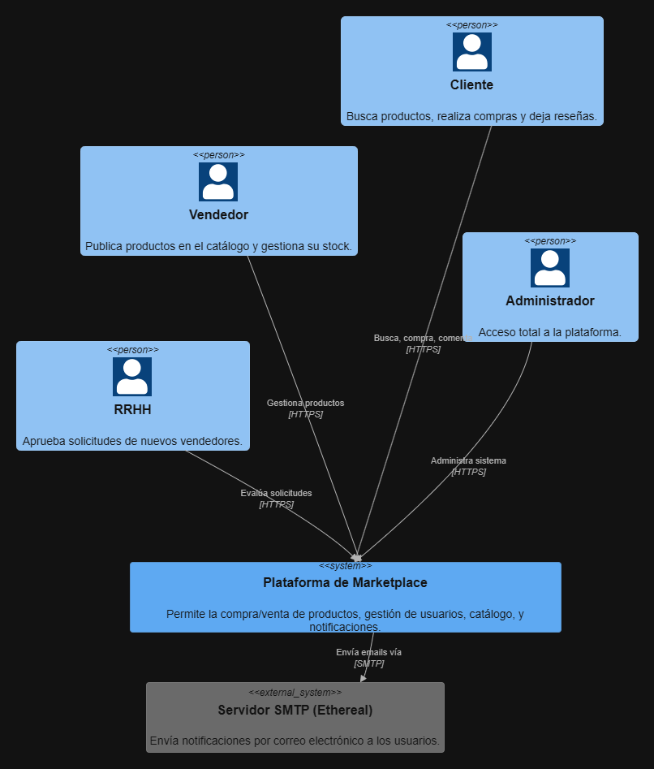
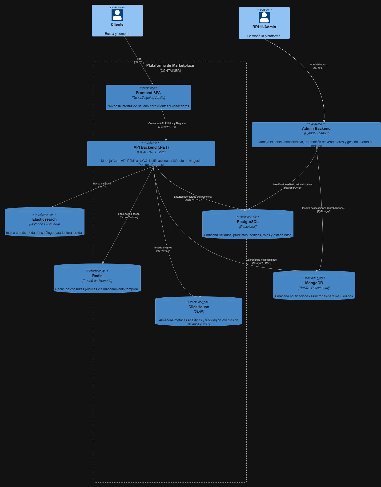
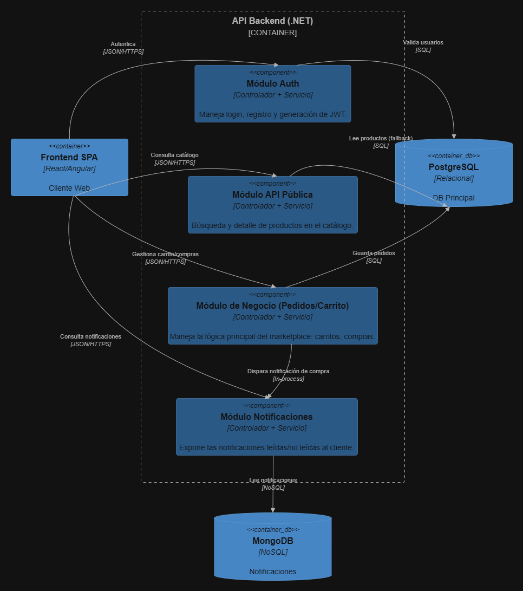
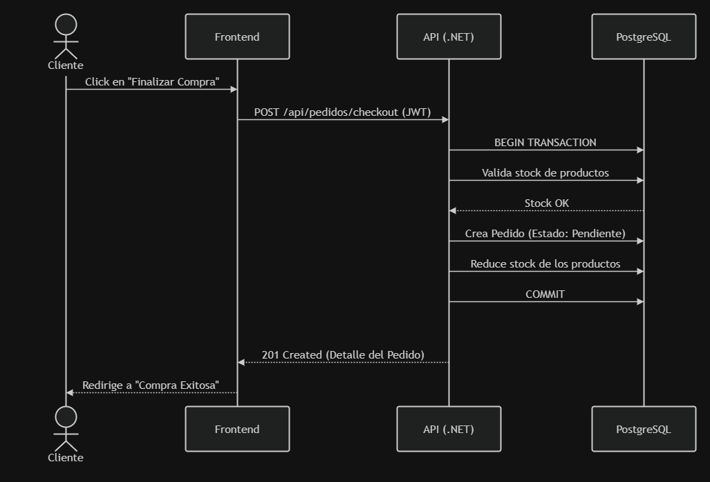
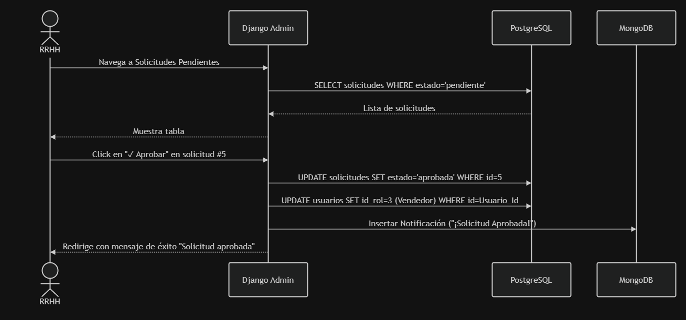
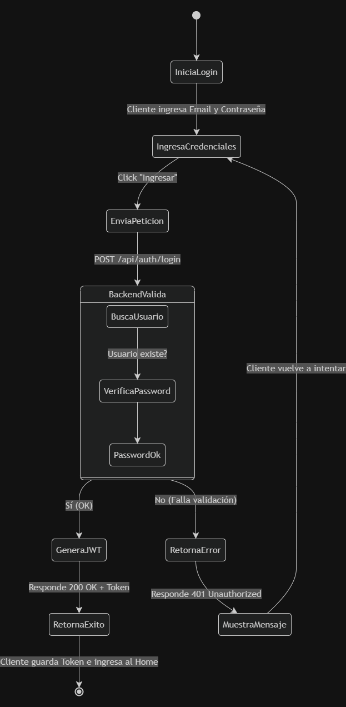
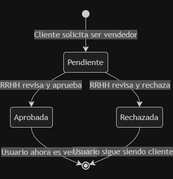
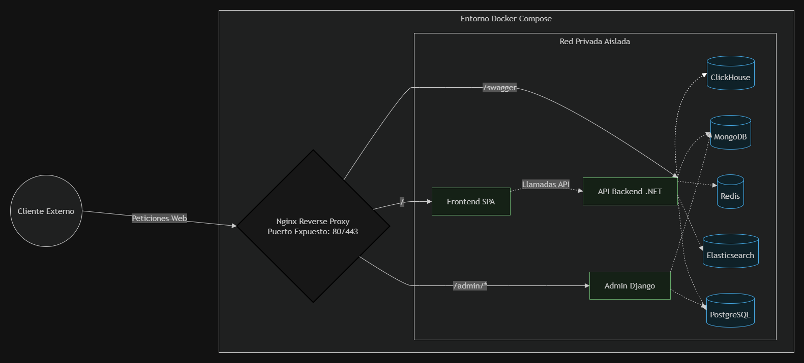

#  Marketplace de Vendedores

Bienvenido al repositorio del proyecto final del curso de Programación Web. Este proyecto consiste en el desarrollo de una plataforma tipo 

**Marketplace multivendedor** (estilo Facebook Marketplace), donde diversos usuarios pueden ofertar sus productos y los clientes tienen la libertad de adquirir artículos de múltiples vendedores de forma centralizada.

##  Gestión del Proyecto
Toda la organización, asignación de tareas y tablero **Kanban** se encuentran gestionados en la pestaña de **Projects** de este repositorio de GitHub.

##  Características y Lógica de Negocio

- **Multivendedor:** Los compradores pueden armar carritos con productos de diferentes proveedores.
- **Escalabilidad de Cuentas:** Cualquier cliente puede enviar una solicitud para convertirse en vendedor dentro de la plataforma.
- **Lógica Avanzada (Precios Dinámicos):** 
  - **Variación por IP:** Precios adaptables dependiendo de la geolocalización o IP del cliente.
  - **Ofertas Flash:** Descuentos y ofertas de tiempo limitado gestionadas por el sistema.

##  Roles de Usuario

El sistema cuenta con una arquitectura de accesos bien segmentada:

1. **Cliente:** Puede navegar, comparar, añadir al carrito y efectuar compras.
2. **Vendedor:** Administra su propio catálogo de productos, visualiza sus ventas 
3. **Administrador:** Dividido en 3 enfoques clave para escalar la carga administrativa:
   - **Full Admin:** Acceso y control total de la plataforma.
   - **Recursos Humanos:** Encargado de analizar y aprobar o rechazar las solicitudes de clientes que desean ser vendedores.

##  Diseño y Prototipado
1. El diseño de la interfaz de usuario se encuentra plasmado en Figma:
    - [Marketplace web frontend](https://cameo-radius-07613459.figma.site/)
2. Diseño de la base de datos 

    

3. Modelo C4 
    * Diagrama de contexto C1

      

    * Diagrama de contenedores C2

      
    
    * Diagrama de componentes C3

      

4. Diagramas UML

    * Diagrama de Secuencia 1: Compra de producto 
      Flujo donde un cliente realiza un pedido de su carrito.
    
      
      
    * Diagrama de Secuencia 2: Solicitud de Vendedor
      Flujo donde Recursos Humanos usa el panel de Django para aprobar a un usuario como Vendedor.

      

    * Diagrama de Actividad: Login

      

    * Diagrama de Estados: Solicitud de Vendedor

      

5. Diagrama de despliegue 

      

##  Stack Tecnológico

El proyecto está diseñado cumpliendo con las rúbricas de evaluación combinando tecnologías nativas y frameworks robustos:

### Frontend
- **Nativo:** Web Components utilizando **TypeScript**.
- **Framework:** **React**.

### Backend
- **Core de la Plataforma (Clientes/Vendedores):** **C#** con **Entity Framework** para un manejo sólido de transacciones permite un despliegue rapido al ser compilado, robustes y tipo de datos tipados y control de errores ademas de librerias nativas de apoyo que implementa .

- **Panel Administrativo:** **Python** con **Django**, ideal para administrar los roles internos rápidamente.

### Justificación del Stack vs. Alternativas (Java y Python puro)

La decisión de utilizar la combinación de C# y Python (Django), y no utilizar Java o depender exclusivamente de Python, obedece a las siguientes prioridades arquitectónicas:

- **¿Por qué C# para el Core de negocio en lugar de Java?** 
  Aunque Java ofrece gran robustez empresarial (ej. Spring Boot), **C# (.NET)** destaca por **Entity Framework** y **LINQ**, herramientas que agilizan dramáticamente el mapeo relacional y las consultas a base de datos. La sintaxis moderna de C# facilita tareas asíncronas y reduce el código repetitivo comparado con Java, logrando un ciclo de desarrollo ágil, estructurado mediante tipado estricto y con excelente rendimiento.
  
- **¿Por qué C# para el Core en lugar de Python?** 
  Python es rápido de desarrollar, pero al ser dinámicamente tipado e interpretado, resulta menos seguro para la lógica transaccional estricta necesaria en un marketplace multivendedor (cálculos de comisiones, carritos mezclados, manejo seguro de concurrencia). C# nos garantiza la validación estricta y velocidad de un lenguaje compilado en esta capa crítica.

- **¿Por qué sí usar Python (Django) para el Panel Administrativo?** 
  Implementar paneles de gestión (control de usuarios, RRHH, reportes de stock) desde cero en C# o Java es muy demandante en tiempo. **Django** proporciona un panel de administración autogenerado (*out-of-the-box*) sumamente robusto. Al usarlo en el backend administrativo, aprovechamos el desarrollo rápido y flexible de Python para las tareas de moderación interna, sin arriesgar el core transaccional del sistema.

# Miembros del Equipo

- Josue Galo Balbontin Ugarteche

- Dariana Pol Aramayo